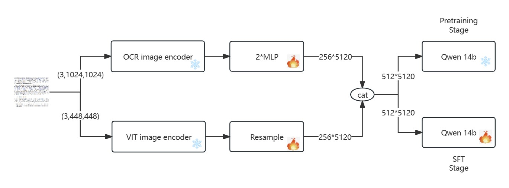
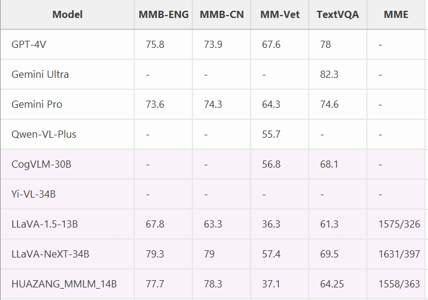
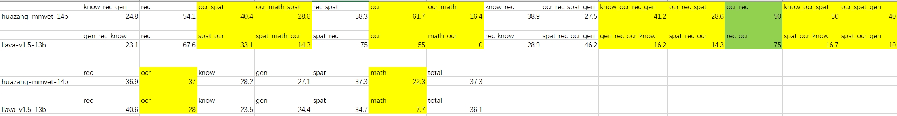

# OCR_MLLM_TOY : A Multimodal Large Language Model for OCR
Our model supports image caption, VQA, especially performs well on OCR-related images. Our model supports Chinese Simplified, Chinese Traditional, and English languages.
[[🤗Space](https://huggingface.co/AIXI-AIGC/OCR_MLLM_TOY/)]
## Overview
<p align="center">
    </a> <br>
    Diagram of OCR_MLLM_TOY Model.
</p>

- [1] OCR image encoder is adopted from an end to end OCR recognition model, here we adopted the pretrain weight from [vary](https://github.com/Ucas-HaoranWei/Vary)
- [2] We adopted VIT image encoder weight from [QwenVL](https://github.com/QwenLM/Qwen-VL)
 
## Release
- [2024/03/08] 🔥 We released the [OCR_MLLM_TOY](https://huggingface.co/AIXI-AIGC/OCR_MLLM_TOY/).
- [2024/03/07] 🔥 We released the training and evaluation code.

**Usage and License Notices**: The data, and code is intended and licensed for research use only. They are also restricted to uses that follow the license agreement of LLaMA, Qwen, Vary 

## Contents
- [Gradio Demo](#gradio-demo)
- [Install](#install)
- [Train](#train)
- [Evaluation](#evaluation)
- [Inference](#inference)

## Gradio Demo

To run our gradio demo, you need to get the checkpoints from [huggingface](https://huggingface.co/AIXI-AIGC/OCR_MLLM_TOY/) and put them in "./checkpoints/qwen14b-finetune_all/checkpoint-8300". Then run the following commands. 

```Shell
python -m ./ocr_mmlm_toy_gradio/my_gradio_web_server.py --host 0.0.0.0 --port 10000
```
<p align="center">
    </a> <br>
    OCR_MLLM_TOY Demo.
</p>

## Install

1. Clone this repository
```bash
git clone https://github.com/SuXuping/OCR_MLLM_TOY.git
```

2. Install Package
```Shell
conda create -n OCR_MLLM_TOY python=3.10 -y
conda activate OCR_MLLM_TOY
pip install --upgrade pip
pip install -r requirements.txt -i https://pypi.mirrors.ustc.edu.cn/simple/
```

3. Install additional packages for training cases
```
pip install ninja
pip install flash-attn --no-build-isolation
pip install deepspeed
```


## Train

OCR_MLLM_TOY is trained on 8 A100 GPUs with 80GB memory. To train on fewer GPUs, you can:
- [1] reduce the `per_device_train_batch_size` and increase the `gradient_accumulation_steps` accordingly. 
- [2] use lora during training. 
- [3] use LLM(7B) instead. 
### 0、Prepare data
Prepare your data in this [format](datasets/3k_sft_en_zh.json):
```
[
    {
        "id": "image_id",
        "image": "image path",
        "conversations": [
            {
                "from": "human",
                "value": "Examine the image closely and share its details<image>\n"
            },
            {
                "from": "gpt",
                "value": "The image shows a man fishing on a lawn next to a river with a bridge in the background. Trees can be seen on the other side of the river, and the sky is cloudy."
            }
        ]
    }
]
```
### 1、Set Hyperparameters
We use a similar set of hyperparameters as LLaVA in pretraining and SFT. more details refer to [pretrain](./scripts/pretrain.sh) and [SFT](./scripts/finetune_qwen.sh)

| Hyperparameter | Global Batch Size | Learning rate | Epochs | Max length | Weight decay | deepspeed |
| --- | ---: | ---: | ---: | ---: | ---: | ---: |
| pretrain | 1024 | 1e-3 | 1 | 1024 | 0 | zero2 |
| SFT | 64 | 2e-5 | 1 | 2048 | 0 | zero3 |

### 2、Prepare training weights 

Before you start train you own MLLM, yuu need prepare some weights:
- [1] prepare your base [LLM]() and put the weights in "./ocr_mllm_toy/pretrain_weight/qwen_pretrain"
- [2] prepare [vit image encoder 448](https://huggingface.co/AIXI-AIGC/OCR_MLLM_TOY/) and put the weights in "./ocr_mllm_toy/pretrain_weight/qwen_vit_448"
- [3] prepare [ocr image encoder 1024](https://huggingface.co/AIXI-AIGC/OCR_MLLM_TOY/) and put the weights in "./ocr_mllm_toy/pretrain_weight/vary_pretrain"

### 3、Run train scripts

The pretrain scripts are provided 
```
sh ./scripts/pretrain_qwen14b.sh
```
The SFT scripts are provided 
```
sh ./scripts/finetune_lora_qwen14b.sh
```
#### Attention: you need change some parameters in ".sh" file according to your device and data.

## Evaluation
we have evaluated OCR_MLLM_TOY on many benchmarks including TextVQA\mm_bench\mm_bench_cn\mm_vet\MME.In some benchmarks our model can achieve similar results as LLaVA Next-34B.
<p align="center">
    </a> <br>
    Evaluation results.
</p>
<p align="center">
    </a> <br>
    Evaluation results of OCR_MLLM_TOY14B and LLaVA13B model on mm-vet benchmark.
</p>
comparing to LLaVA13B on mm-vet benchmark our model achieve better results in OCR related dimensions.

Please see this [doc](EVAL.md) for the details.

## Inference

To run our inference, you need get our weights from here  [huggingface](https://huggingface.co/AIXI-AIGC/OCR_MLLM_TOY/), and put them in "./checkpoints/qwen14b-finetune_all/checkpoint-8300" .
We provide interactive api for multimodal infence with stream outputs. 
```
python cli.py
```
we also provide LLM only infence and multimodal infence in "infence.py".
```
python inference.py
```

## Acknowledgement
- [LLaVA](https://github.com/haotian-liu/LLaVA): the codebase we built upon. 
- [vary](https://github.com/Ucas-HaoranWei/Vary): the ocr image encoder pretrain weight we built upon.
